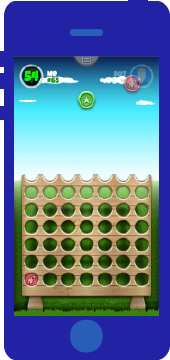
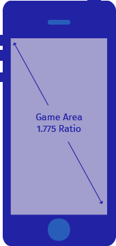
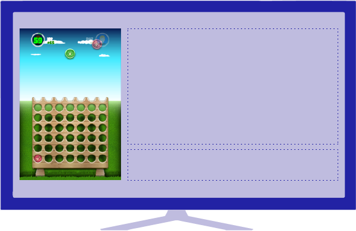
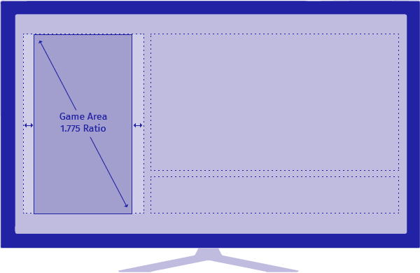
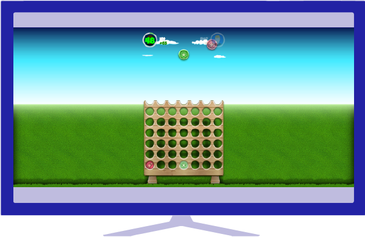
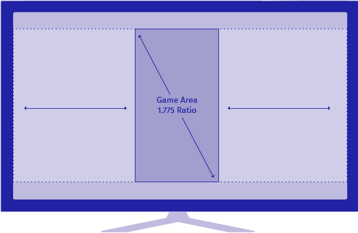

---

    <ul class="sub-nav">
        <li data-magellan-arrival="aspect-ratio"><a href="#aspect-ratio">Aspect ratio</a></li>
        <li data-magellan-arrival="csp-restrictions"><a href="#csp-restrictions">CSP Restrictions</a></li>
    </ul>

---

<h3 data-magellan-destination="aspect-ratio">Aspect ratio</h3>

For a seamless integration with the Phune Gaming platform we recommend all the games to be implemented using the aspect ratio of **1.775** (same as iPhone 5).

This is how a game looks on a smartphone device:

<ul class="small-block-grid-1 medium-block-grid-2">
    <li class="text-center">
        
    </li>
    <li class="text-center">
        
    </li>
</ul>

This is how a game looks on a TV set using the split-screen option:

<ul class="small-block-grid-1 medium-block-grid-2">
    <li class="text-center">
        
    </li>
    <li class="text-center">
        
    </li>
</ul>

This is how a game looks on a TV set using the full-screen option:

<ul class="small-block-grid-1 medium-block-grid-2">
    <li class="text-center">
        
    </li>
    <li class="text-center">
        
    </li>
</ul>


The game background can (and should) be enriched with additional elements when running in full screen mode on a TV set.


---

<h3 data-magellan-destination="csp-restrictions">CSP restrictions</h3>

Phune Gaming fully supports [Firefox OS](https://developer.mozilla.org/en-US/Firefox_OS). However, Phune Gaming is distributed as a Firefox OS privileged type of app which enforces the [CSP (Content Security Policy)](https://developer.mozilla.org/en-US/docs/Security/CSP/Introducing_Content_Security_Policy) by default.

This may cause existing code to break. To guarantee your game is fully functional on Firefox OS, follow the best practices below during the development:

* Include all JavaScript and CSS files locally in your game instead of loading them remotely.
* Don't embed JavaScript in `<script>` tags in HTML files since the inline scripts are banned. You should place the code in an external JavaScript file and reference it via the `src` attribute. 
* HTML event attributes like `onclick` and `onload` are also considered inline scripts, thus add them as event listeners in your JS files.
* Don't assign content to the `innerHTML` property of dimanically created `<script>` tags.
* Don't assign remote URLs to the `src` property of dinamically created `<script>` tags.
* Don't use the `eval()` function or the `eval` operator.
* Don't use the `javascript:` pseudo-protocol (e.g. `<a href="javascript:alert('foo')">`).
* Don't use the `Function()` constructor.
* Pass callable objects (i.e. functions) to `setTimeout` and `setInterval`. Strings and other data types are not callable objects.
* Don't use plugins (e.g. `<object>`, `<embed>`, etc.).
* Don't create Web Workers with remote URLs.

For additional information consult the [applicable CSP restrictions for Firefox OS](https://developer.mozilla.org/en-US/Apps/CSP).

---

What's next? Go to [Install Phune Gaming](install.html) to learn how to install the Phune Gaming client platform.
