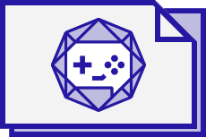

Welcome to the Phune Gaming game development documentation. Here you will find everything you need to know to develop games for the Phune Gaming platform.

### What is Phune Gaming?

Phune Gaming is a social multiplayer HTML5 gaming platform which allows casual games to be played online against real users. The Phune Gaming platform is composed of three main components:

* A highly scalable and performant application server
* The Phune Gaming client platform
* And the games

### Why should I develop games for Phune Gaming?

Phune Gaming supports multiple platforms including desktop, mobile and TV. Developing a game for Phune Gaming will allow you to reach a vast number of gamers who will be able to play your game no matter where they are or what device they use.

### What knowledge do I need?

To develop a game for Phune Gaming you will need to build two essential components: the game itself and server-side rules. For the game you can use your HTML, CSS and JavaScript skills and, if you prefer, you are free to use your favorite JavaScript game engine. The server-side rules are needed to manage the game states and validate the players' moves. The server-side rules can be written in JavaScript, Java or Drools.

### How to submit a game?

In order to add a new game to Phune Gaming, we require that a developer send us the following components:

* The game distribution/binary
* The server-side rules used for server validations


For the time being, Phune Gaming platform only supports turn based games with two players.


To implement and test these components on your development machine, please follow the guides below:

<ul class="small-block-grid-2">
    <li class="text-center">
        <a href="install.html">


Install Phune Gaming

        </a>
    </li>
    <li class="text-center">
        <a href="best-practices.html">


Best practices

        </a>
    </li>
    <li class="text-center">
        <a href="sdk-js.html">


JavaScript SDK

        </a>
    </li>
    <li class="text-center">
        <a href="server-rules.html">


Server-Side Rules

        </a>
    </li>
</ul>

Alongside the documentation, feel free to have a look at the [Tic-Tac-Toe source code](https://github.com/phune-gaming/pg-tic-tac-toe) for a complete game implementation example.

Once you are ready, send us an email to [pg-dev@present-technologies.com](mailto:pg-dev@present-technologies.com) with the two required components for a review and we will give you our feedback.

Good luck!  
Present Technologies

---

What's next? Go to [Best practices](best-practices.html) to find more about Phune Gaming's best practices for game development.
